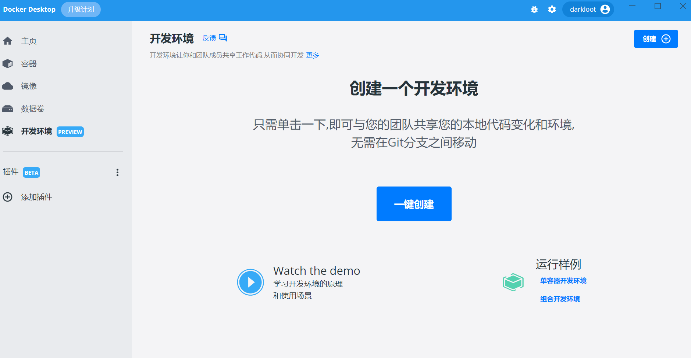
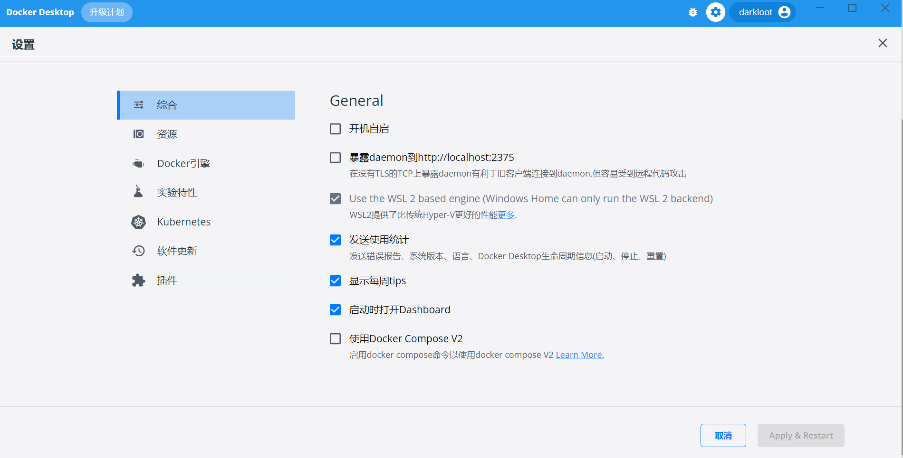

# DockerDesktopChinese
Docker汉化版	DockerDesktop汉化版	Docker Windows汉化版	Docker中文版

##### 介绍

> 本项目由本人自行汉化, 且只翻译了一部分, ~~后续会不断修补~~(由于本人毫无动力,暂时不更新了)
>
> $\color{red}该汉化版本是\bold{4.9.1},版本差太多的话,可能出现白屏情况,请先做好备份$

##### 效果图

##### 汉化方法

1. Docker安装目录(一般是`C:\Program Files\Docker\Docker\frontend\resources`)中找到app.asar并备份

2. 将本仓库提供的app.asar替换上述文件
